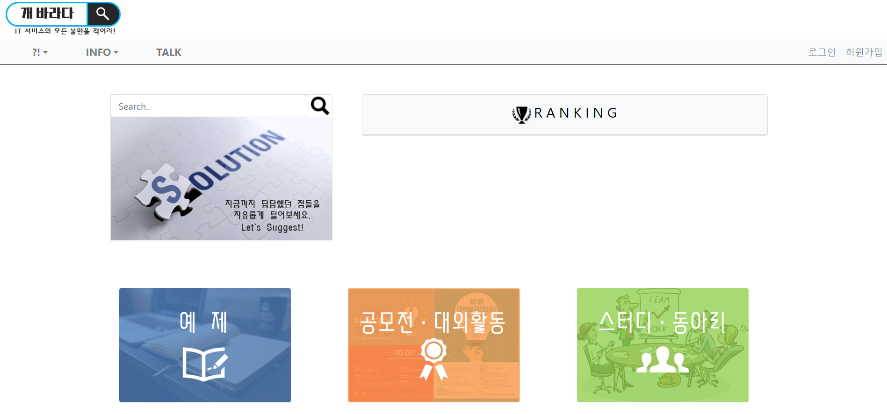
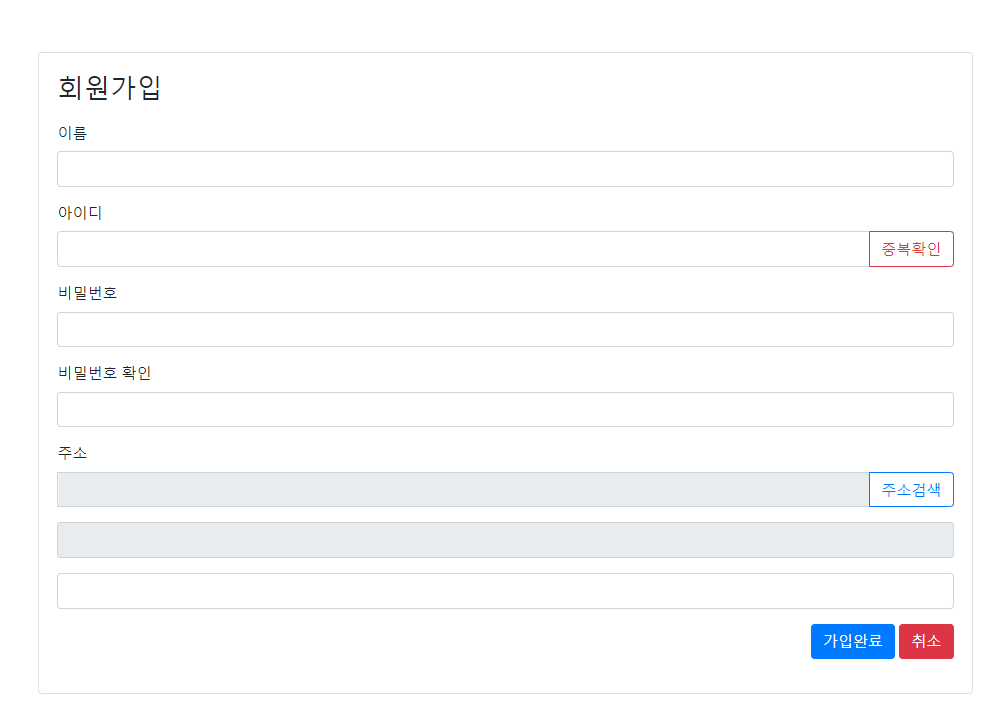
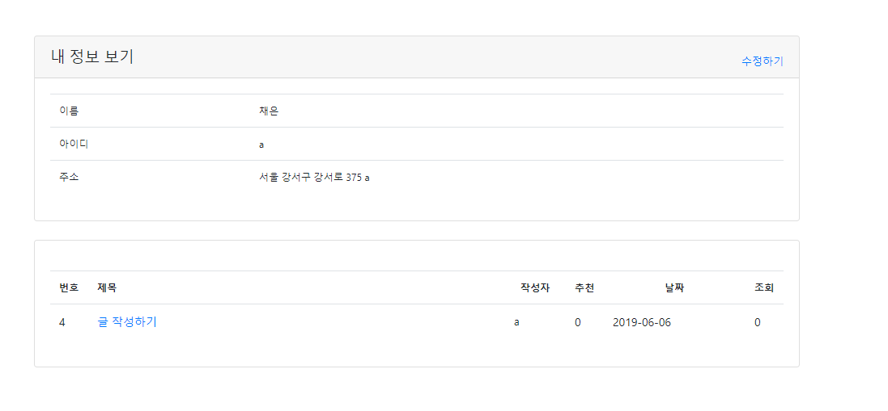
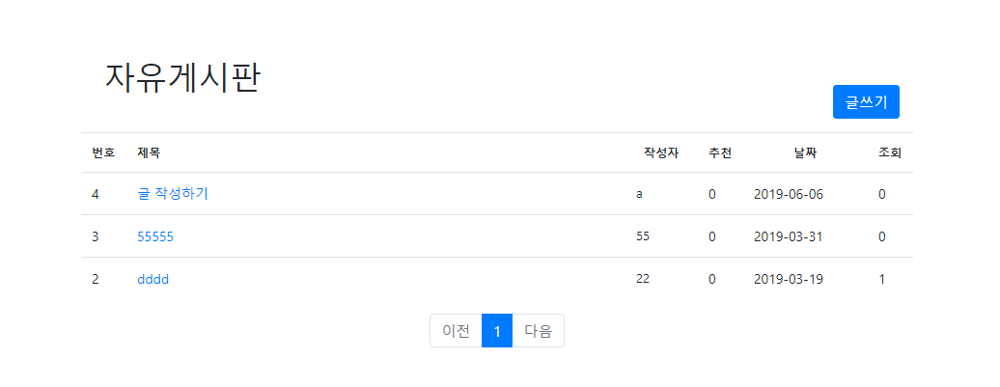
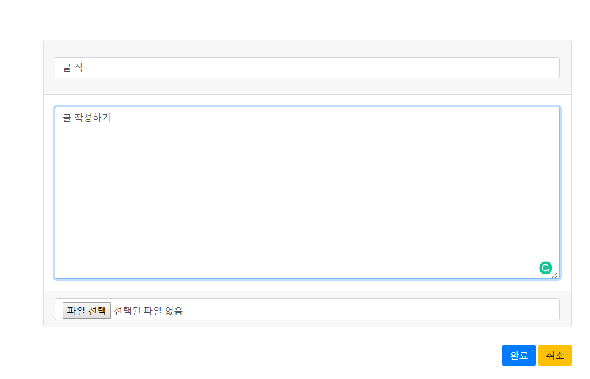

 * 2019.02.20 ~ 2019.02.26

About
--------
* gaballada(개바라다) 

  - IT 서비스 이용시 불편사항에 대해 건의하고 이야기를 나눌 수 있는 게시판
  
  - 기본적인 게시판 기능 구현
  
    
  
* tools & environments

  - Python 3.7 & Flask
  - visual studio code
  
  - MySQL
  
   - HTML, javascript, CSS
  
  

Feautures
---------
 * 기본적인 게시판 기능 구현하기
   
 * USER  -  회원관리 전반기능 구현
   
    + 회원가입 (join)
    
      - 유효성 검사
    
      - 다음 주소 API 활용
   + 로그인 / 로그아웃 (login / logout)
   + 마이페이지 / 내 정보 수정하기
     - 내가 작성한 글 모아보기
   
- BOARD
  
   + 게시판 글 목록보기
     - 페이지네이션
   + 글 작성하기 
     - 로그인한 사용자만 글을 작성할 수 있도록 처리
   + 글 수정 및 삭제하기
     - 글을 작성한 당사자만 수정 및 삭제 가능
   
   
   

## 개선할 점

- DB 설계할 때 불필요하게 중복되는 부분에 대한 고려가 이루어지지 않아서 중복된 부분 통합
  - 게시판 마다 DB table을 만들다 보니 지나치게 파일이 많아져서 보기 어려움
  - 공통되게 처리할 수 있는 부분은 통합하기
- 보안을 고려해서 인증Authorization 고려해서 다시 설계하기
- JSON 형태로 정보를 저장하지 않고 바로 DB로 넘겨줌 (...)  - 이 부분 수정하기
- 댓글 기능, 좋아요 / 조회수 기능 추가
- Ajax로 처리할 수 있는 부분들 처리하기
